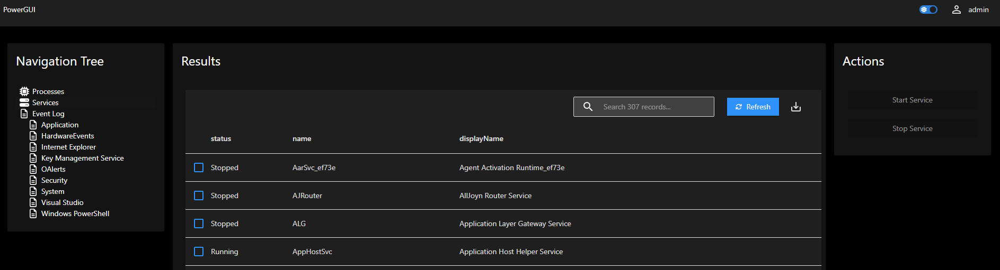
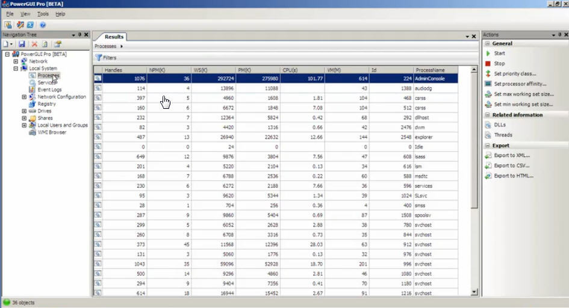

# PowerGUI App

A [PowerGUI Administrative Console](https://4sysops.com/archives/powergui-create-powershell-scripts-with-a-gui/) clone made in PowerShell Universal.

### PowerShell Universal PowerGUI

### PowerGUI 3.8

Includes the Local System PowerPack functionality. 

- Processes
- Services
- Event Log
- Users
- Groups

### Role-Based Access

- Administrator - Administrators have access to the entire app.
- PowerGUI User - Has access to the app.