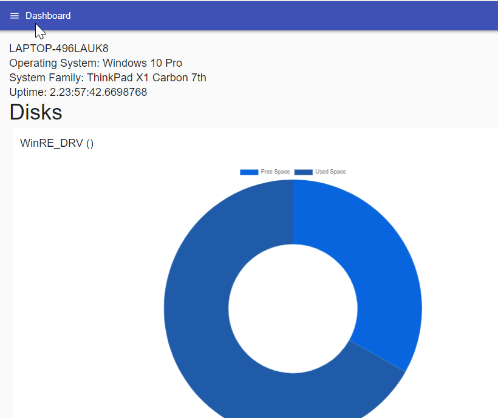
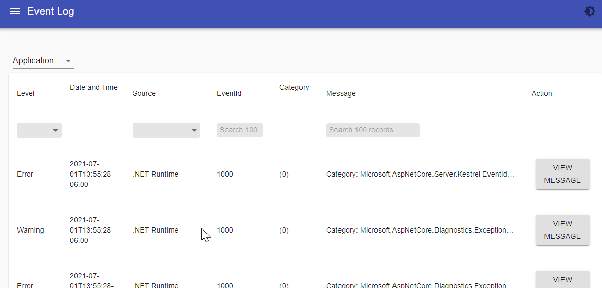
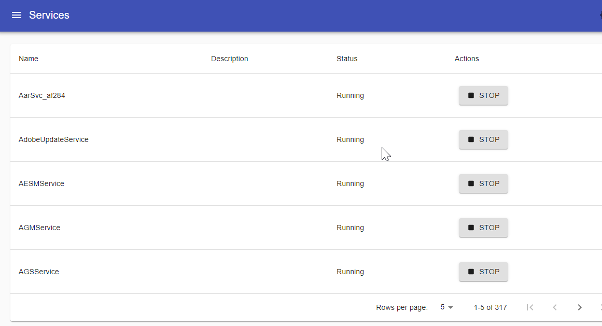

# Windows System Information App

A PowerShell Universal app that displays Windows System Information. 

This app displays the following: 

- Processes 
- Services
- Event Log
- Network Information
- Temperatures
- Uptime
- Operating System Information 

