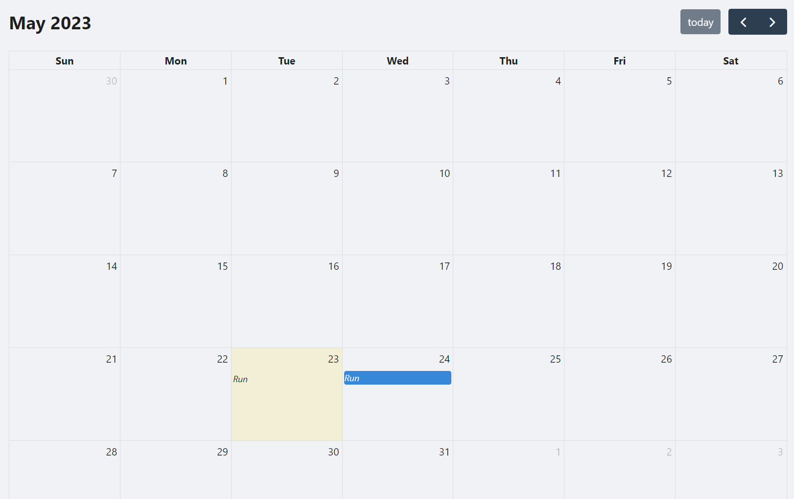
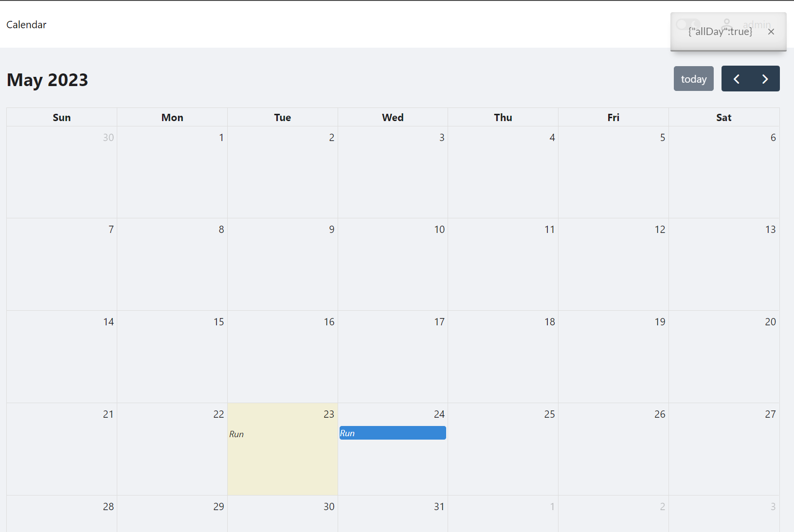
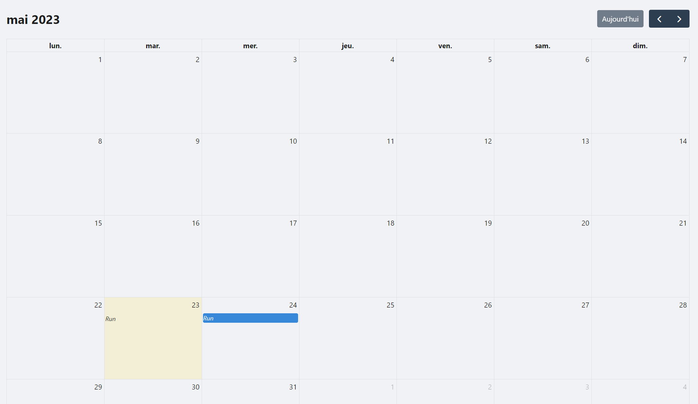
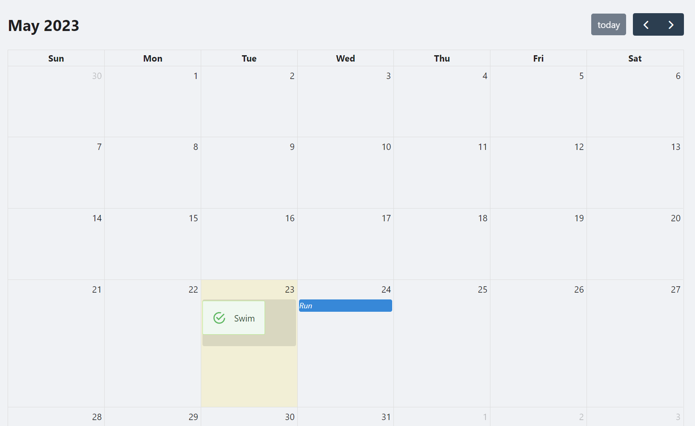

## PowerShell Universal App Calendar

A calendar component for PowerShell Universal Apps. 

## Installation

You can install this component as a PowerShell module using PowerShellGet or via PowerShell Universal.

```powershell
Install-Module Universal.Components.Calendar
```

## Usage

### Basic

A basic calendar with events. 

```powershell
New-UDCalendar -Events @(
        New-UDCalendarEvent -Title "Run"
        New-UDCalendarEvent -Title "Run" -Start ((Get-Date).AddDays(1)) -AllDay
) 
```



### DateClicked

An event handler that is fired when a date is clicked.

```powershell
New-UDCalendar -Events @(
        New-UDCalendarEvent -Title "Run"
        New-UDCalendarEvent -Title "Run" -Start ((Get-Date).AddDays(1)) -AllDay
) -DateClicked {
        Show-UDToast $Body
}
```



### Locale

Localization of the calendar. 

```powershell
New-UDCalendar -Events @(
        New-UDCalendarEvent -Title "Run"
        New-UDCalendarEvent -Title "Run" -Start ((Get-Date).AddDays(1)) -AllDay
) -Locale 'fr'
```



### Custom Event Rendering

Use the `-Content` parameter of `New-UDCalendarEvent` to customize the rendering of an event. 

```powershell
New-UDCalendar -Events @(
        New-UDCalendarEvent -Content {
                New-UDAlert -Text 'Swim'
        }
        New-UDCalendarEvent -Title "Run" -Start ((Get-Date).AddDays(1)) -AllDay
) 
```



## Development

You will need NodeJS version 16.13.2 and the InvokeBuild module installed to build this module. 

You can run `Invoke-Build` within this directory to build this component.

```powershell
Invoke-Build
```

The output will be found within the output folder.