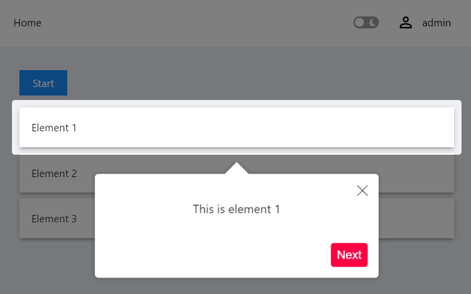

## PowerShell Universal App Joyride

Create awesome tours for your app!

Showcase your app to new users or explain functionality of new features.

## Installation

You can install this component as a PowerShell module using PowerShellGet or via PowerShell Universal.

```powershell
Install-Module Universal.Components.Joyride
```

## Usage

### Basic

```powershell
New-UDJoyride -Steps {
            New-UDJoyrideStep -Target '#element1' -Content { 'This is element 1'}
            New-UDJoyrideStep -Target '#element2' -Content { 'This is element 2'}
            New-UDJoyrideStep -Target '#element3' -Content { 'This is element 3'}
        } -Id 'joyride' -Continuous -ScrollToFirstStep -ShowProgress -ShowSkipButton -Run $false

        New-UDButton -OnClick {
            Set-UDElement -Id 'joyride' -Properties @{
                run = $true
            }
        } -Text 'Start'

        New-UDPaper -Elevation 3 -Children {
            New-UDTypography -Text 'Element 1'
        } -Id 'element1'
        New-UDPaper -Elevation 3 -Children {
            New-UDTypography -Text 'Element 2'
        } -Id 'element2'
        New-UDPaper -Elevation 3 -Children {
            New-UDTypography -Text 'Element 3'
        } -Id 'element3'
```

