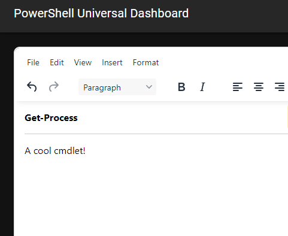

# TinyMCE for PowerShell Universal Apps

This component integrates the [TinyMCE](https://www.tiny.cloud) React component into PowerShell Universal. 



## Installation 

```powershell
Install-Module Universal.Components.TinyMCE
```

## Usage

```powershell
New-UDTinyMCE
```

## Parameters 

- `Init` - Hashtable of TinyMCE [initialization options](https://www.tiny.cloud/docs/tinymce/6/basic-setup/)
- `InitialValue` - The initial value of the editor
- `OnEditorChange` - An event handler that receives the value of the editor when it changes